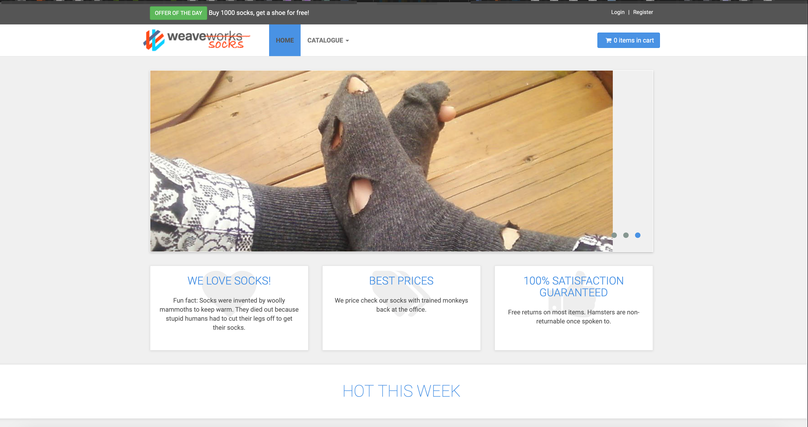

 # Socks Shop Microservices Deployment on Kubernetes

 ## Project overview

 This project demonstrates the deployment of the Socks Shop example microservices-based application on Kubernetes using Infrastructure as Code (IaaC). The goal is to automate the deployment process, ensuring quick, reliable, and secure deployment while emphasizing readability and maintainability

 ## Project Description

 The project involves deploying the Socks Shop microservices demo, an application that represents a typical microservices architecture. The deployment will be automated using either Ansible or Terraform, and the application will run on a Kubernetes cluster.

## Project Structure
 
```
socks-shop/
├── .github/
│   └── workflows/
│       └── ci-cd.yaml    # GitHub Actions workflow for CI/CD
├── deployment│
│      └── CartsDBSvc.yaml
|      └── CartSvc.yaml
|      └── CatalogueDBSvc.yaml
|      └── CatalogueSvc.yaml
|      └── Front-EndSvc.yaml
|      └── namespace.yaml
|      └── OrdersDBSvc.yaml
|      └── OrderSvc.yaml
|      └── PaymentSvc.yaml
|      └── QueueMstrSvc.yaml
|      └── RabbitMQSvc.yaml
|      └── SessionDBSvc.yaml
|      └── ShippingSvc.yaml
|      └── UserDBSvc.yaml
|      └── UserSvc.yaml
├── monitoring/
│   ├── prometheus/
│   │   └── values.yaml   # Custom values for Prometheus Helm chart
│   └── grafana/
│       └── values.yaml   # Custom values for Grafana Helm chart
├── logging/
│       ├── cronjob.yaml  
│       ├── elasticsearch.yaml  
│       └── filebeat.yaml      
|       └── kibana-deployment.yaml        
|       └── logstash-deployment.yaml     
|       └── metricbeat.yaml   
├── terraform/
│   ├── main.tf         
│   ├── terraform.tf    
│   ├── outputs.tf      
│   ├── provider.tf     
│   └── vpc.tf
├── ingress.yaml          
└──README.md
```

## The project includes:

### Infrastructure provisioning and management using IaaC.
### Monitoring with Prometheus and visualization with Grafana.
### Logging with Prometheus.
### HTTPS setup using Let’s Encrypt certificates.
### Network perimeter security and encryption of sensitive information.

## **Setup and Configuration:**
Prerequisites
Kubernetes Cluster (can be provisioned on any IaaS provider of your choice)
Prometheus and Grafana for monitoring and logging
Ansible or Terraform for configuration management
Let’s Encrypt for HTTPS certificates
Infrastructure
The infrastructure includes:

### - Kubernetes cluster for running the Socks Shop application.
### - Prometheus for monitoring, Grafana for visualization.
### - Network security with perimeter access rules.
### - Deployment Pipeline
The deployment pipeline involves the following steps:
- Provisioning Infrastructure: Using Ansible or Terraform to set up the Kubernetes cluster.
- Deploying Socks Shop: Automating the deployment of the application on the Kubernetes cluster.
- Setting Up Monitoring and Logging: Deploying Prometheus, Grafana, and configuring them for the application.
- Enabling HTTPS: Configuring Let’s Encrypt for SSL/TLS certificates.
- Security Configuration: Implementing network security rules and encrypting sensitive data using Ansible Vault.
- Monitoring and Logging
Prometheus: Used for monitoring the application and Kubernetes cluster.
- Grafana: Integrated with Prometheus to visualize metrics.
- Alertmanager: Configured to handle alerts based on Prometheus metrics.
Security
- HTTPS: The application is secured with HTTPS using Let’s Encrypt certificates.
- Network Perimeter Security: Access rules are defined to secure the infrastructure.
- Using Terraform:
Initialize Terraform.
Apply the Terraform configuration to provision the Kubernetes cluster.
Deploy the Application
Use the provided scripts or playbooks to deploy the Socks Shop application on the Kubernetes cluster.
Monitor the deployment using Prometheus and Grafana.
Enable HTTPS
Configure Let’s Encrypt certificates for HTTPS.
Update the Kubernetes Ingress to use the generated certificates.


Step  1.  Create a new directory for the Terraform configuration files and navigate to it.

        mkdir PROJECT
        cd PROJECT

Step 2: Provision Kubernetes Cluster
Use your IaaS provider to create a Kubernetes cluster. The cluster should have sufficient resources to run the microservices.

For Terraform:


      terraform init
            


Step 3: Deploy Prometheus for Monitoring
Deploy Prometheus and Grafana using Helm.


      helm repo add prometheus-community https://prometheus-community.github.io/helm-charts
      helm repo update
      helm install prometheus prometheus-community/kube-prometheus-stack --namespace monitoring --cr   

Step 4: Apply the Terraform Configuration
To deploy Prometheus, run:


      terraform apply

  


Terraform will prompt you to confirm the plan. Type yes to proceed. Terraform will then create the necessary resources in your Kubernetes cluster.

Step 5: Verify the Deployment
After Terraform completes the deployment, you can verify the Prometheus deployment with kubectl:


      kubectl get pods -n monitoring

You should see the Prometheus pods running in the monitoring namespace. To lists all resources in all namespaces within your Kubernetes cluster, run:

      kubectl get all -A


To list all the resources in the sock-shop namespace, including Pods, Services, Deployments, ReplicaSets, and other resources associated with the namespace, run:

      kubectl get all -n sock-shop


Step 6: Access Prometheus
To access Prometheus, you can use port forwarding:


      kubectl port-forward -n monitoring svc/prometheus-server 9090:80       

Step 7: Deploy Socks Shop Application
 
 Deploy the Socks Shop application using Helm.


      helm repo add microservices-demo https://microservices-demo. github.io/helm-charts/
      helm install socks-shop microservices-demo/socks-shop --namespace socks-shop --create-namespace
      





Step 8: Setup Logging and Metrics
Ensure that Prometheus is scraping metrics from the Socks Shop application. You may need to customize the Prometheus configuration to include the necessary metrics endpoints.


## Additional Resources
- [Kubernetes Documentation](https://kubernetes.io/docs/home/)
- [Prometheus Documentation](https://prometheus.io/docs/introduction/overview/)
- [Socks Shop Documentation](https://github.com/microservices-demo/microservices-demo)
- [Terraform Documentation](https://developer.hashicorp.com/terraform/docs)
- [AWS Documentation](https://docs.aws.amazon.com/)

## Conclusion
This project successfully automates the deployment of the Socks Shop microservices application on Kubernetes using Infrastructure as Code (IaC). By leveraging tools like Ansible or Terraform, Prometheus for monitoring, and Helm for package management, we ensure a scalable, maintainable, and secure infrastructure. The setup is designed to be easily reproducible, with clear steps for provisioning, deployment, and monitoring, making it ideal for rapid deployments in a DevOps environment. This approach not only streamlines the deployment process but also reinforces best practices in automation, security, and observability, setting a solid foundation for managing microservices at scale.


